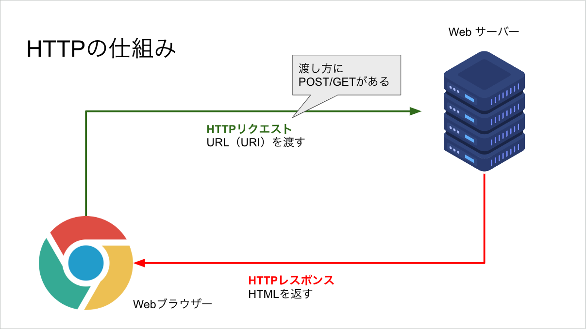
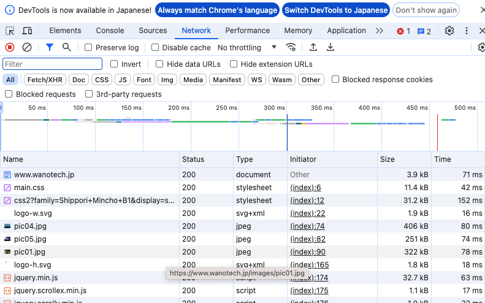

# PythonWEB演習

## 概要
WEB基礎で作成したKujiraCafeを動的コンテンツで再構築する。


## HTTPの仕組み/Chromeの開発者機能


### CROMEの開発者機能
ブラウザ上で右クリック ->　検証  
または  
ブラウザ右上の点三つのメニュー -> その他ツール -> デベロッパーツール
Networkのタブを開くと通信の詳細を見ることができる。



## Python と Web
### Pythonで作られているWebサービス
- YouTube
- Instagram
- Spotify
- Dropbox
- Pinterest
- Evernote

注）全てがPythonだけで作られている訳ではありません

### Python Web技術
PythonでWebシステムを構築するにはいくつかの方法がある。
- CGIライブラリ：現在非推奨
- Django：Pythonの代表的なフレームワーク(フル装備)
- Flask：Pythonの代表的なフレームワーク(比較的軽量、必要最低限から拡張)
- Bottle：機能は少ないが軽量でシンプルなフレームワーク

今回の実習ではFlaskを利用して、KujiraCafeを動的なサイトに改良していく。

## Flaskのインストール
Flaskは外部モジュールのため、インストールが必要です。
JupyterLabを立ち上げ、ランチャーからターミナルを選択。
pipコマンドでflaskをインストールします。
```
pip install flask
```
インストールされている内容を確認したい場合は
```
pip list
```
のコマンドでインストール済み一覧を表示します。

## Flaskを動かしてみる
JupyterLab上で表示 > ファイルブラウザを選択、ファイル一覧を表示します。  
新しいフォルダを作成し、webという名前をつけましょう。  
作成したwebフォルダを開き、ランチャーからpythonファイルを作成します。  
ファイル名を`main.py`に変更します。  以下`main.py`の内容です。
```
# Flaskをインポート
from flask import Flask

# Flaskインスタンスを生成
app = Flask(__name__)

# ルート(URL)と関数を関連づける
# http://localhost:ポート番号/ でアクセスするとindexメソッドを呼び出します。
@app.route('/')
def index():
    return "<p>Flask!</p>"


# Flaskを起動する
# hostとportを指定
# debugをTrueにすると変更を自動で読み取ります
if __name__ == "__main__":
    app.run(host="0.0.0.0", port=8800, debug=True)
```

現時点でのディレクトリとファイルの構成
```
├── web
│   └── main.py
```

## Flaskを起動する
ターミナルで
```
python main.py
```
と呼び出します。
ブラウザ上で確認してみましょう。
URL：http://localhost:8800/

## テンプレート機能を使ってみよう
メソッドに直接HTMLを書くのは実用的ではありませんのでテンプレート機能を利用してHTMLファイルを呼び出しましょう。

呼び出すファイルを作成します。
ファイルはwebフォルダ直下、templatesフォルダ内に`test.html`として保存します。
HTMLファイルの内容です。
```html:test.html
<!DOCTYPE html>
<html lang="ja">
<head>
    <meta charset="UTF-8">
    <meta name="viewport" content="width=device-width, initial-scale=1.0">
    <title>Flask Test</title>
</head>
<body>
    <p>Flask Template!</p>
</body>
</html>
```
pythonファイルを修正します。
```python:main.py
from flask import Flask, render_template

### 中略 ###

def index():
    return render_template("test.html")

```
`render_template`を使うと、templatesフォルダ内の指定されたファイルをレスポンスします。
デフォルトでtemplatesフォルダを利用する設定になっています。
変更したい場合は、Flaskコンストラクタの引数に`template_folder=`のオプションを渡します。

### テンプレートにデータを渡す
テンプレートファイルにはPythonからデータを渡す事が出来ます。  
pythonファイルの修正

```python:main.py
from flask import Flask, render_template
import datetime

### 中略 ###

def index():
    current = datetime.datetime.today().strftime('%Y年%m月%d日')
    return render_template("test.html",current=current)
```
テンプレートのHTMLファイルを編集します。
```html:test.html
<p>Flask Template!</p>
<p>{{current}}</p>
```

ブラウザからどのように変わったか確認してみましょう。
現時点でのディレクトリとファイルの構成
```
├── web
│   ├── main.py
│   └── templates
│       └── test.html
```

## 静的ファイルの取り扱い
動的要素のない静的なファイルの取り扱いを学びます。
CSSファイル(css/style.css)をリンクさせてましょう。

Pythonファイルの修正
```python main.py
#....中略....
# Flaskインスタンスを生成
app = Flask(__name__,static_folder='static')
#....中略....
```
HTMLファイルの修正
```html:test.html
    <!-- 中略 -->
    <title>Flask Test</title>
    <link rel="stylesheet" href="static/css/style.css">
</head>
```
作業フォルダ内にstaticフォルダを作成、staticフォルダ内にcssフォルダを作成、cssフォルダ内にcssファイル(`style.css`)を作成します。
CSSファイルの内容

```css:style.css
p{
    color:#f00;
}
```

現時点でのディレクトリとファイルの構成
```
├── web
    ├── main.py
    ├── static
    │   └── css
    │       └── style.css
    └── templates
        └── test.html
```

[以降はPythonWeb2.mdに続く](PythonWeb2.md)